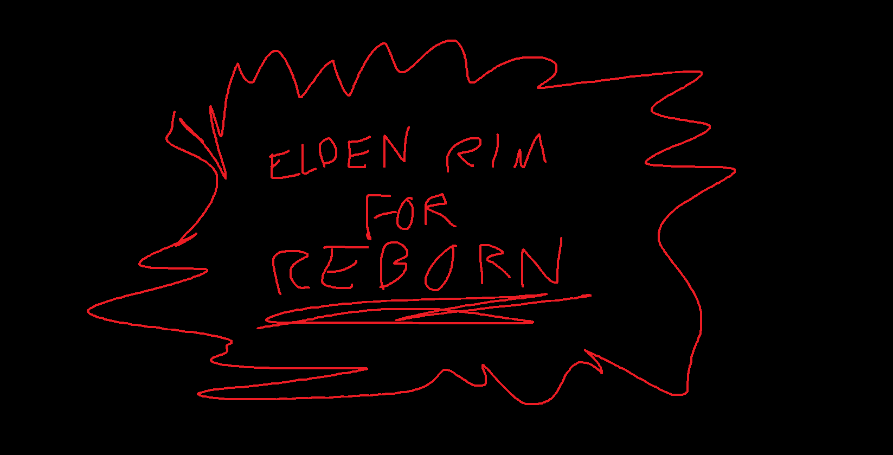

# Elden Rim Together

**Next-gen Skyrim with multiplayer.**

A Wabbajack modpack built around the hard part: making a heavily-modded, modern "next-gen" Skyrim work with **Skyrim Together Reborn** ([STR on Nexus Mods](https://www.nexusmods.com/skyrimspecialedition/mods/69993)).

---

**Current Version:** 3.4.2
**Last Updated:** June 28, 2026
**Game Version:** Skyrim Special Edition 1.6.1170+
**Wabbajack File:** `Elden Rim Together.wabbajack`

---

## Table of Contents
- [What makes this special](#what-makes-this-special)
- [Requirements](#requirements)
- [Installation (Wabbajack)](#installation-wabbajack)
- [First launch checklist](#-first-launch-checklist)
- [Skyrim Together Reborn setup](#skyrim-together-reborn-setup)
- [Updating the modpack](#updating-the-modpack)
- [Gameplay tips](#gameplay-tips)
- [Troubleshooting](#-troubleshooting)
- [FAQ](#faq)
- [Support](#support)
- [Credits / License](#credits--license)

---

## What makes this special
- **Multiplayer-first design**: curated and tested overhaul to work with **Skyrim Together Reborn**.
- **Modern "next-gen" Skyrim**: combat/animation/visual modernization *without* sacrificing co-op stability.
- **Long-term curation**: built and iterated over years with a focus on reducing desyncs, crashes, and "modded Skyrim friction."

<b>What does this modpack actually feel like?</b>

 

**Before**

You open your eyes on a balcony of weathered stone, high above Nirn. Clouds drift past your feet. The Sovngarde sky burns gold and impossible overhead. No cart, no executioner, no dragon — not yet. Just wind, silence, and a choice to make.

The Messenger waits near the edge — a dragon, ancient and patient. Talk to him and he asks where your story begins: soldier, outlaw, stranger to the land. Or step over to the Statue of Akatosh and pick your scenario there. Around the ruin sit a handful of offering chests: a weapon, a little coin, a few gems for a rainy day. Take what feels right.

Then you step off the mountain. Skyrim happens to you.

**After**

You step out into Skyrim and immediately notice — this isn't the game you remember.

The combat is sharp. Every swing has weight, every parry is a commitment. You dodge a bandit's overhead strike and riposte with your katana — Elden Ring muscle memory kicking in. But this bandit isn't the pushover you expected. He's a Manhunter, and his buddy — a Shadowblade — just flanked you. They have abilities. They fight smart. You barely survive.

Your hands are shaking. Not yours — your character's. That fight left a mark. Stress is creeping in, and the game gently suggests you take a break. Maybe grab a drink at the inn, pet a dog, go fishing. Ignore it, and your stamina and magicka start to suffer. Push too hard, nearly die to a wolf pack, and you might develop an actual phobia — your vision narrows, your damage drops. The only cure? Face them again and win.

The road to Windhelm is brutal in winter. The cold saps your stamina, and you forgot to pack warm gear. You duck into a cave for shelter, but it's dark — really dark — and the darkness itself is making things worse. You light a torch and press deeper. Draugr down here aren't the shambling corpses you remember either. The Restless Dead made sure of that.

You sell your loot in Whiterun, but prices have shifted since last week. The Civil War is heating up, supply lines are strained, and winter doesn't help. That house you've been saving for? Just got more expensive. At least your reputation with the Companions is bringing merchant prices down a bit.

And through all of this — your friend is right there with you. Skyrim Together Reborn keeps you connected, fighting side by side, sharing the chaos. Save often. Stay close. Don't fast travel without warning them.

This is Elden Rim Together.

---

## Requirements

### Game + DLC / CC (critical)
- **Skyrim Special Edition (Steam)**
- **Game version**: **1.6.1170+**
- **Creation Club**: **Only the 4 FREE items**:
  - Fishing, Rare Curios, Survival Mode, Saints & Seducers

> **Do NOT install the Anniversary Edition upgrade bundle (AE).**
> This modpack is **not compatible** with the full AE CC bundle. If you install AE content, your install will likely fail or behave incorrectly. This is crucial as the stock game files will be copied over during the Wabbajack install.

### Accounts
- **Nexus Mods account** (Premium strongly recommended for automated downloads)

### Required apps
- **Wabbajack**: [wabbajack.org](https://www.wabbajack.org/)
- **Microsoft Visual C++ Redistributable (x64) 2015–2022**
- **.NET Desktop Runtime 6+**

### Hardware (performance tiers)

#### Bare Minimum (1080p, ENB off/light, performance options on)
| | Spec |
|---|---|
| **CPU** | i5-9600K / Ryzen 5 3600 |
| **GPU** | GTX 1660 Super / RTX 2060 / RX 5600 XT (6 GB+) |
| **RAM** | 16 GB (32 GB strongly preferred) |
| **Storage** | SSD, ~300 GB free |
| **OS** | Windows 10/11 64-bit |

#### Recommended (intended visuals + stable co-op at 1080p/1440p)
| | Spec |
|---|---|
| **CPU** | i7-10700K / Ryzen 7 3700X+ |
| **GPU** | RTX 3060 Ti / RTX 3070 / RX 6700 XT (8 GB+; 12 GB nicer) |
| **RAM** | 32 GB |
| **Storage** | SSD/NVMe, 300 GB free |
| **OS** | Windows 10/11 64-bit |

#### High/Ultra (1440p/4K, heavier ENB/LOD)
| | Spec |
|---|---|
| **CPU** | Ryzen 7 5800X3D / i7-12700K+ |
| **GPU** | RTX 4070+ / RX 7800 XT+ (12 GB+ VRAM) |
| **RAM** | 32–64 GB |
| **Storage** | NVMe preferred, 300 GB free |
| **OS** | Windows 10/11 64-bit |

---

## Installation (Wabbajack)

### Step 0 — Pick sensible folders (avoid Windows pain)
Use short, simple paths that are **NOT** in Program Files / Desktop / Documents.

Recommended:
- **Wabbajack**: `C:\Wabbajack`
- **Modlist install**: `C:\Modlists\Elden`
- **Downloads**: `C:\Modlists\Elden\downloads` (or another fast drive)

### Step 1 — Clean Skyrim install (IMPORTANT)
1. Uninstall **Skyrim Special Edition** in Steam
2. Delete the game folder (if it still exists):
   `C:\Program Files (x86)\Steam\steamapps\common\Skyrim Special Edition`
3. Delete (or archive) your configs/saves folder:
   `Documents\My Games\Skyrim Special Edition` *(archive saves if you want)*
4. Reinstall Skyrim SE in Steam
5. Launch Skyrim **once** to the **main menu** to generate INIs
6. **Do NOT download / enable Anniversary Edition CC.**
7. Close Skyrim

### Step 2 — Install Wabbajack
1. Download Wabbajack from: [wabbajack.org](https://www.wabbajack.org/)
2. **Do not run it from your Downloads folder**
3. Create `C:\Wabbajack`
4. Move/extract and run `Wabbajack.exe` from there
5. In Wabbajack settings, **log into your accounts** (Nexus, etc.)

### Step 3 — Install "Elden Rim Together"
1. Open Wabbajack → **Browse Modlists**
2. Find **Elden Rim Together**
3. Set paths:
   - **Installation Location**: `C:\Modlists\Elden`
   - **Download Location**: `C:\Modlists\Elden\downloads` (or a fast drive with space)
4. Start the install and let it finish completely

If downloads fail for known Wabbajack reasons, use Wabbajack's official troubleshooting here:
- [Wabbajack Troubleshooting FAQ](https://wiki.wabbajack.org/user_documentation/Troubleshooting%20FAQ.html#troubleshooting-faq)

### Step 4 — Shortcuts (use Wabbajack's button)
When Wabbajack completes, use the **"Create Shortcuts"** button it provides (recommended) instead of manually creating them.

---

## ✅ First launch checklist
1. Launch **Mod Organizer 2** from your installed modlist folder
2. The **startup dashboard** appears. Configure resolution, ENB, frame gen, gamepad, NSFW, etc., then click **Apply**
3. Select **SKSE** from the executable dropdown (top right) → click **Run**
4. Start a **new game**. Old saves are not compatible
5. Pick your origin in the **Alternate Perspective Reborn** hub (see below)

### Picking your start (Alternate Perspective Reborn)
You'll spawn in AP Reborn's hub instead of the vanilla cart. Two interactables:
- **The Messenger (dragon)**: talk to it → pick a starting scenario and location
- **Statue of Akatosh**: same scenario menu, alternate way to open it

Have a look around the hub before you leave. There are chests with starter gear, a few gems, and some coin to get you going.

**Two ways to start a co-op session:**
- **A) Meet in the hub**: everyone connects while still in AP's hub, picks their scenario together, then leaves the hub at the same time
- **B) Solo, then meet up**: each player picks their scenario solo, exits the hub, *then* connects and meets up at one player's assigned spawn location

From here, you can roam Skyrim freely with your buddies. If you want to start the **Main Quest**, see the Helgen note below. Heads-up: **some quests won't start until the vanilla intro is completed**, so most groups end up doing the intro at some point.

### Want to watch the vanilla Helgen intro?
AP starts you **before** the dragon attack, so the vanilla intro doesn't auto-play.
- Travel to **Helgen** → talk to the **innkeeper** → rent the room marked `(start intro)`
- You'll watch the attack as a **bystander**, not as the prisoner on the cart
- If the intro bugs out mid-cutscene, **disconnect**, finish it solo, then reconnect after

### Changing dashboard settings later
Want to tweak ENB / frame gen / gamepad / NSFW after the fact?
1. In MO2's top toolbar, click the **puzzle piece icon**
2. Select **Modular MO2 Dashboard** from the list
3. Follow the prompt to **restart MO2**. The dashboard wizard will come back on next launch

### Key bindings reference
| Key | Action |
|---|---|
| `Right Ctrl` / `F2` | Skyrim Together Reborn UI (STRUI) |
| `Tab` | Inventory |
| `M` | Map |
| `K` | Skills |
| `J` | Journal |

Full bindings: [Control Bindings](https://github.com/DJLegends1011/Elden-Rim-Together/blob/main/Control%20Bindings)

---

## Skyrim Together Reborn setup

### One-time client setup ("point STR to SkyrimSE.exe")
1. Open **Mod Organizer 2**
2. Pick **`SkyrimTogether`** from the executable dropdown
3. Hold **`SPACEBAR`** and click **Run**
4. When prompted, select: `[Your Install]\Stock Game\SkyrimSE.exe`
   - Example: `C:\Modlists\Elden\Stock Game\SkyrimSE.exe`
5. Launch again (no SPACEBAR). STR will remember the path

If you picked the wrong .exe, see [this troubleshooting page](https://wiki.tiltedphoques.com/tilted-online/guides/troubleshooting/help-i-selected-the-wrong-.exe-when-first-launching-skyrimtogether.md).

### Joining a server (every player does this)
1. Launch the game via MO2 → **`SkyrimTogether`** → **Run**
2. Get through AP Reborn into the actual world (intro is optional, see First Launch)
3. Press **`Right Ctrl`** or **`F2`** → STRUI opens
4. Click **`Connect`**
5. Enter:
   - **Address:** `<host IP>:10578` (or whatever port the host set)
   - **Password:** whatever the host set (blank if no password)
6. Click **`Connect`**. Chat will say `Succesfully connected to a server`

### Multiplayer tips
- **Save often**: desyncs happen
- **Stay close**: STR works best when players are near each other
- **Coordinate fast travel**: don't teleport without warning your party
- **Same modlist, same version**: everyone needs identical loadorder and modpack version

---

## Hosting your own server

You host by running **`SkyrimTogetherServer.exe`**, a separate program that ships with the STR mod. The server can run on the same PC as your game, or on a different machine. It doesn't matter.

### Step 1 — Launch the server (one-time firewall step)
1. Open MO2 → right-click the **Skyrim Together Reborn** mod → **Open in Explorer**
2. Open the inner `Skyrim Together Reborn` folder
3. Double-click **`SkyrimTogetherServer.exe`**
4. Windows Firewall will pop up → **Allow on BOTH Private AND Public networks**
5. A console window stays open. That's your server. Closing it shuts down the server.

> 💡 The default port is **`10578`** (both UDP **and** TCP). That's the only number your friends need.

### Step 2 — Pick a hosting method
Three ways to let friends reach you. Pick one:

#### Option A — Same house / same WiFi (easiest)
1. Open Command Prompt → type `ipconfig` → find **IPv4 Address** (looks like `192.168.x.x`)
2. Friends connect to `192.168.x.x:10578` from STRUI
3. You (the host) connect to `127.0.0.1:10578` from your own client
4. Done. No port forwarding, no VPN.

#### Option B — Radmin VPN (easiest for online play without router setup)
**Host:**
1. Download & install [Radmin VPN](https://www.radmin-vpn.com/) (free, Windows)
2. Click **`Create network`** → set a network name + password → **`Create`**
3. Share the **network name + password** with friends (not your IP)
4. Once a friend joins the network, your Radmin IP shows next to your name in the main window
5. Give them `<your Radmin IP>:10578` to connect in STRUI

**Friend:**
1. Install Radmin VPN
2. Click **`Join network`** → enter the host's network name + password → **`Join`**
3. Connect in STRUI to `<host Radmin IP>:10578`

Alternatives that work the same way: [ZeroTier](https://www.zerotier.com/) (account + network ID required), Hamachi.

#### Option C — Port forwarding (advanced, true public hosting)
Use this if you want a permanent public server. Skip if Option B works for you.

1. Open your router's admin page (usually `192.168.1.1` or `192.168.0.1`)
2. Find **Port Forwarding** / **NAT** / **Virtual Server** settings
3. Create a new rule:
   - **Service Name:** Skyrim Together
   - **External Port:** `10578`
   - **Internal Port:** `10578`
   - **Protocol:** **Both** (TCP **and** UDP). If your router only allows one, make **two** rules
   - **Internal IP:** your PC's local IPv4 (from `ipconfig`)
4. Add a Windows Firewall inbound rule for **UDP 10578** AND **TCP 10578**
5. Get your public IP from [icanhazip.com](https://icanhazip.com/)
6. Friends connect to `<your public IP>:10578`

**Still stuck?** The official wiki has detailed router walkthroughs and a ZeroTier guide:
- [STR Server Guide — full walkthrough](https://wiki.tiltedphoques.com/tilted-online/guides/server-guide)
- [STR Windows Server Setup](https://wiki.tiltedphoques.com/tilted-online/guides/server-guide/windows-setup)

### Server settings (optional)
Server config lives at: `[STR mod folder]\config\STServer.ini`

Most useful keys:
- `sPassword=`: server password (blank = no password)
- `sServerName=`: name shown in server list
- `uMaxPlayerCount=8`: max players
- `uPort=10578`: change if you want a non-default port
- `bAnnounceServer=false`: set `true` to show in the public server list (only works if no password)

Full reference: [STR Server Configuration](https://wiki.tiltedphoques.com/tilted-online/guides/server-guide/server-configuration)

> ⚠️ **Stop the server before editing `STServer.ini`.** Changes mid-run get overwritten.

---

## Updating the modpack
- Re-run Wabbajack for the modlist and point it at the **same install/download folders**.
- Wabbajack will only replace what changed (when possible).

---

## Gameplay tips

<b>Click to expand gameplay tips</b>

 

### Loot balance (Open World Loot)
- **Loot scales with your level**, but with guardrails. No glass armor on roadside bandits
- **High-tier gear is earned**: Ebony+ only appears in boss chests and from high-level enemies
- **Unique artifacts are your real endgame**: normal loot is a stepping stone, not the destination

### Encounter zones (Roleplaying in Skyrim)
- **The world isn't deleveled**: you can explore freely, but enemy difficulty has floors based on what lives there
- **Enemy type matters most**: bandit camps are manageable early on, but vampire lairs, Falmer hives, and Dragon Priest dungeons have high minimum levels regardless of your level
- **Location matters too**: dungeons near major holds are easier; secluded or high-altitude areas are significantly tougher
- **Encounters are randomized**: enemy levels shift each time you enter an area, so the same dungeon can feel different on a second visit
- **Some enemies will chase you**: combat boundaries are removed in many zones, so retreating through a door isn't always a safe exit
- **Don't be afraid to leave**: if a dungeon is wiping you, come back later. That's intended

### Economy (Roleplaying in Skyrim - Evolving Economy)
- **Prices aren't static**: the economy evolves based on the Civil War, seasons, location, and your reputation
- **Supply and demand applies**: resource-rich holds have cheaper goods; remote or war-torn areas cost more
- **Winter hits the wallet**: harsh seasons drive prices up, especially in northern holds
- **Your reputation matters**: progressing through major factions (Companions, College, Thieves Guild, Dark Brotherhood) improves prices across all merchants
- **Everything costs more**: housing, carriages, hirelings, and services are all pricier than vanilla. Jobs pay less too
- **Clearing enemies helps commerce**: making roads safer improves trade prices, but also raises property values

### Enemies (Rogues 'n Raiders + creature overhauls)
- **Bandits are no longer pushovers**: enemy NPCs have been overhauled with new classes, perks, combat styles, and special attacks
- **Variety is real**: you'll encounter Berserkers, Rogues, Shadowblades, Manhunters, Bruisers, Wildlings, and more, each fighting differently
- **Enemies have abilities**: different classes have unique attacks that can inflict injuries and debuffs, so tanking hits has consequences
- **Mages are deadlier too**: Necromancers, Conjurers, and Elementalists each have distinct spellsets and faction abilities
- **Veterans show up early**: tougher veteran enemies can appear from level 6 onward, so don't assume early dungeons are a cakewalk
- **Creatures are overhauled too**: vampires, dragons, draugr, and other creatures are all stronger and more varied than vanilla. Don't expect a level 3 dragon fight to go like base Skyrim

### Stress & fear (Stress and Fear + Stressful Darkness)
- **Combat causes stress**: getting hurt builds stress, which reduces your max stamina and magicka over time
- **Darkness is stressful too**: lingering in dark dungeons without a light source raises stress and makes your vision worse. Bring a torch
- **Phobias can develop**: barely surviving a fight against a creature type (wolves, dragons, Falmer, etc.) can give you a fear of that enemy, reducing your damage against them by 25%
- **Face your fears to conquer them**: defeating enemies you're afraid of can cure the phobia, granting permanent 10% bonus damage against that type and immunity to that fear
- **Relax to de-stress**: drink alcohol, eat comfort food, pet a dog, go fishing, take a bath, sleep at an inn, or play music to bring stress back down

### Survival (The Frozen North)
- **Cold weather matters**: snowstorms, nighttime, and icy regions drain your stamina regen. Combined with stress, your stamina can take a real hit if you're cold AND stressed
- **Bring warm gear**: clothing warmth rating determines how well you handle the cold (same system as CC Survival Mode)
- **Can't fast travel when freezing**: if you're Cold or Freezing, you need to warm up before you can fast travel or wait
- **Food gives small bonuses**: eating enough to restore 10 HP gives "Well Fed" (20% faster health regen for 8 hours). No punishment for skipping meals
- **Sleep to level up**: you must rest to spend perk points. Sleeping well after eating gives bonus stamina or magicka regen for the day
- **Soups are your friend**: rebalanced soups provide sustained health/stamina recovery in the cold. Alcohol gives quick stamina relief but slows regen after

### Combat
- **Learn to parry**: Elden Parry is powerful but requires timing
- **Manage stamina**: every attack costs stamina, don't mash
- **Weapon movesets matter**: katanas, rapiers, twinblades, and scythes all play differently
- **Hold attack for power moves**: heavy/special attacks on hold
- **Use your movement**: True Directional Movement lets you strafe and backpedal mid-fight

### Multiplayer
- **Save often**: desyncs happen, save frequently
- **Do quests together**: quest sync works best when you're both present
- **Stay close**: STR works best when players are near each other
- **Coordinate fast travel**: don't teleport away from your co-op partner

---

## 🔧 Troubleshooting

### Wabbajack download errors (Curios / CC-related)
**Problem:** Wabbajack fails with errors like `Unable to download Data_ccbgssse037-curios.esl`

**Fix:** Follow the official steps here (this covers the Rare Curios case-sensitivity issue and the correct recovery flow):
- [Wabbajack Troubleshooting FAQ – Unable to download Curios files](https://wiki.wabbajack.org/user_documentation/Troubleshooting%20FAQ.html#unable-to-download-curios-files)

### "Can't find SkyrimSE.exe" / Skyrim Together won't launch
**Problem:** STR won't launch or says it can't find the game.

**Why this happens:** STR needs to be pointed to the modlist's **Stock Game** executable on first launch.

**Fix:**
1. Open **Mod Organizer 2**
2. Select **`SkyrimTogether`** (or the STR entry) from the executable/profile dropdown
3. Hold **`SPACEBAR`** while clicking **Run**
4. When the file browser appears, select:
   `[Your Install]\Stock Game\SkyrimSE.exe`
   Example: `C:\Modlists\Elden\Stock Game\SkyrimSE.exe`
5. Try launching again (**without** holding SPACEBAR)

### Game crashes on startup (instant crash / logo crash)
Try these:
- **Verify you're launching correctly**:
  - Always launch via **MO2 → `SKSE` → Run**
  - Never launch from Steam
- **Antivirus exclusions**:
  - Add your modlist folder (MO2) to antivirus exceptions
  - Add the modlist's **Stock Game** folder to exceptions
- **Update GPU drivers**:
  - NVIDIA: [nvidia.com/drivers](https://www.nvidia.com/Download/index.aspx)
  - AMD: [amd.com/support](https://www.amd.com/en/support)
- **ENB troubleshooting (older GPUs can struggle)**:
  - Temporarily disable ENB-related mods/output in MO2 and test boot
- **Verify the install**:
  - In Wabbajack: **Install from Disk → Verify** (checks for corruption/missing files)

### Infinite loading screen
**Problem:** Stuck on a loading screen "forever".

Try these, in order:
- **First-time load can be slow**: wait **3–5 minutes** on the first boot.
- **New game stuck**:
  - Close the game after ~5 minutes
  - Delete saves at: `Documents\My Games\Skyrim Special Edition\Saves`
  - Try again
- **Missing masters**:
  - In MO2, check for missing plugin masters / red warning icons
  - If present: reinstall/repair via Wabbajack
- **Too many saves**:
  - Keep your saves lean; huge save folders can slow menus and loads

### Low FPS / performance issues
Try these:
- **Reduce ENB cost**:
  - In-game: `Shift + Enter` (ENB menu)
  - Disable expensive effects (examples): Subsurface Scattering, Complex Fire Lights, Detailed Shadows
- **Lower grass density**:
  - Edit `SkyrimPrefs.ini`
  - Find `iMinGrassSize=` and set to **60–80** (higher = less grass)
- **DynDOLOD output**:
  - Temporarily disable "DynDOLOD Output" in MO2 to test FPS improvement
- **Disable overlays/background hooks**:
  - Discord overlay, Xbox Game Bar, GeForce overlay, etc.

### Skyrim Together connection issues
**Problem:** Can't connect to a friend's server.

Try these:
- **Firewall**:
  - Allow the relevant `SkyrimSE.exe` through Windows Firewall (Private + Public)
- **Port forwarding (host)**:
  - Ensure **UDP 10578** is reachable if hosting over the internet
  - Use a port test site like [canyouseeme.org](https://canyouseeme.org/) (host-side)
- **IP address sanity**:
  - LAN: `192.168.x.x:10578`
  - Internet: `<public-ip>:10578`
- **Version mismatch**:
  - Everyone must be on the **same modlist version** and **identical load order**
- **VPN fallback**:
  - If port forwarding is a barrier, use a VPN solution ([Radmin VPN](https://www.radmin-vpn.com/) / Hamachi) and connect via the VPN IP

### Missing textures / purple objects
**Problem:** Purple/missing textures or meshes.

**Fix:**
- This usually indicates an incomplete install or failed downloads.
- Re-run the Wabbajack install and confirm it ends with **Installation Complete**.
- In MO2, look for missing masters / warnings (red icons). If you see them, assume the install is incomplete and reinstall/repair with Wabbajack.

### "Failed to initialize renderer"
Try these:
- Install the [DirectX End-User Runtime](https://www.microsoft.com/en-us/download/details.aspx?id=35) and reboot
- Do **not** stack a different ENB on top of the pack's setup
- Confirm the game is using the dedicated GPU (not integrated):
  - NVIDIA Control Panel → Manage 3D Settings → Program Settings → select `SkyrimSE.exe` → High-performance NVIDIA processor

### Controls not working / keybinds wrong
Try these:
- Check the pack's bindings reference: [Control Bindings](https://github.com/DJLegends1011/Elden-Rim-Together/blob/main/Control%20Bindings)
- Reset controls in-game: **Settings → Controls → Reset to Defaults**
- If the pack provides a control preset, re-apply it (then re-check the bindings reference above)

### Crashes in specific locations
Try these:
- Confirm your install is complete and unmodified (don't add/remove mods while troubleshooting)
- Check GitHub for updates (some repeatable crashes get fixed in later versions)
- If you must isolate:
  - Disable suspect mods **one at a time**, testing the problem area each time (only if you understand the risk to stability/sync)
- Report it with logs:
  - Provide crash logs from `Documents\My Games\Skyrim Special Edition\SKSE`
  - Include exact location, what you were doing, and whether it's repeatable

---

## FAQ
**Q: Can I add my own mods?**
A: Not recommended. The modlist is carefully balanced for multiplayer. Adding mods may cause desyncs or crashes.

**Q: Can I remove mods I don't like?**
A: Some mods can be safely disabled (visual mods mostly), but removing gameplay mods can break things. Ask in Discord first.

**Q: Does everyone need the same mods for multiplayer?**
A: Yes, all players must have identical mod load orders and the same modlist version for STR to work properly.

**Q: Can I use old saves?**
A: No, you must start a new game with this modlist. Old saves can crash or behave unpredictably.

**Q: How do I update the modlist?**
A: Re-run Wabbajack with the new modlist file and point it at the same install/download folders. It will only download changed files (when possible).

**Q: Can I use this without multiplayer?**
A: Yes, single-player works great too.

**Q: Is Creation Club content required?**
A: Only the **4 FREE Creation Club items** are compatible (Fishing, Rare Curios, Survival Mode, Saints & Seducers). The full Anniversary Edition upgrade bundle (100+ paid CC content) is **not compatible** with this version. An AE-compatible variant may be released later.

**Q: Can I change the ENB preset?**
A: Yes, but performance and visuals may vary. If the pack ships with a tuned ENB preset, that is the recommended baseline.

**Q: Why is my character moving slowly?**
A: Check if Survival Mode is enabled. It can affect carry weight and movement speed.

**Q: Can I use controllers?**
A: Yes. Controller support is included. See the bindings reference if anything feels off.

---

## Support
- **Discord**: [Elden Rim Together Discord](https://discord.gg/YwU4dF2X9V)

### GitHub
- **Issues**: [Report bugs / install problems](https://github.com/DJLegends1011/Elden-Rim-Together/issues)
- **Changelog**: [View version history](https://github.com/DJLegends1011/Elden-Rim-Together/blob/main/Changelog)
- **Documentation**: [Repository README / guides](https://github.com/DJLegends1011/Elden-Rim-Together)

### Useful resources
- **Wabbajack**: [wabbajack.org](https://www.wabbajack.org/)
- **Skyrim Together Reborn (GitHub / TiltedPhoques)**: [tiltedphoques on GitHub](https://github.com/tiltedphoques)
- **SKSE**: [skse.silverlock.org](https://skse.silverlock.org/)
- **Nexus Mods (Skyrim SE)**: [nexusmods.com/skyrimspecialedition](https://www.nexusmods.com/skyrimspecialedition)

---

## Credits / License

**Modlist Author:** [DJLegends1011](https://github.com/DJLegends1011), creator and maintainer

**Special Thanks:**
- Skyrim Together Reborn Team: for making multiplayer Skyrim possible
- Wabbajack Team: for the automated modlist installer
- SKSE Team: for the Script Extender
- All mod authors: for the incredible mods that make this possible
- The Discord community: for testing, feedback, and support

This modlist is provided free of charge for personal use. All mods remain the property of their original creators. Please support mod authors by endorsing their work on Nexus Mods.

**Do not:**
- Reupload this modlist without permission
- Claim this modlist as your own work
- Use this modlist for commercial purposes

---

*Last Updated: June 28, 2026 — Version 3.4.2*
